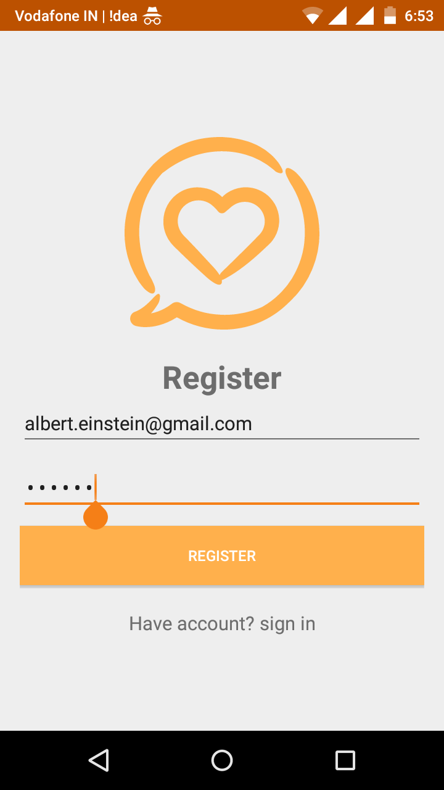
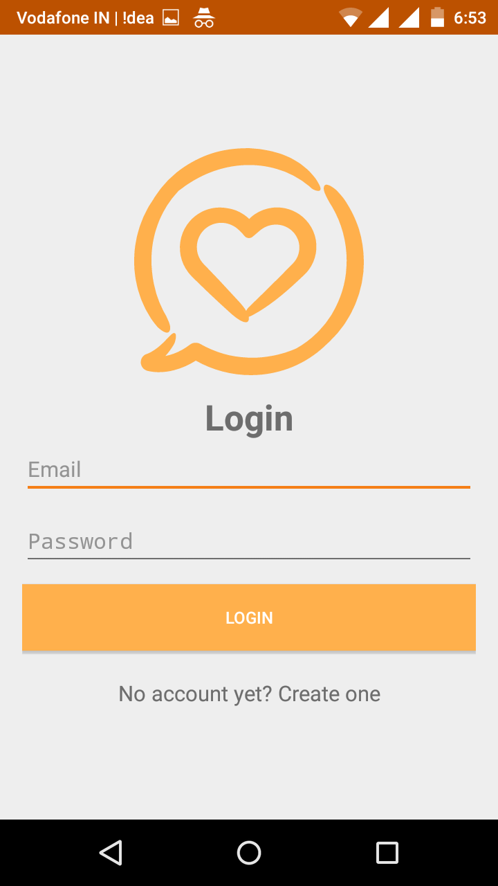
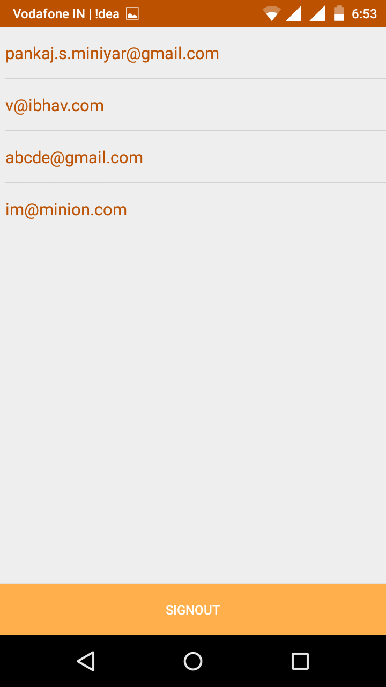
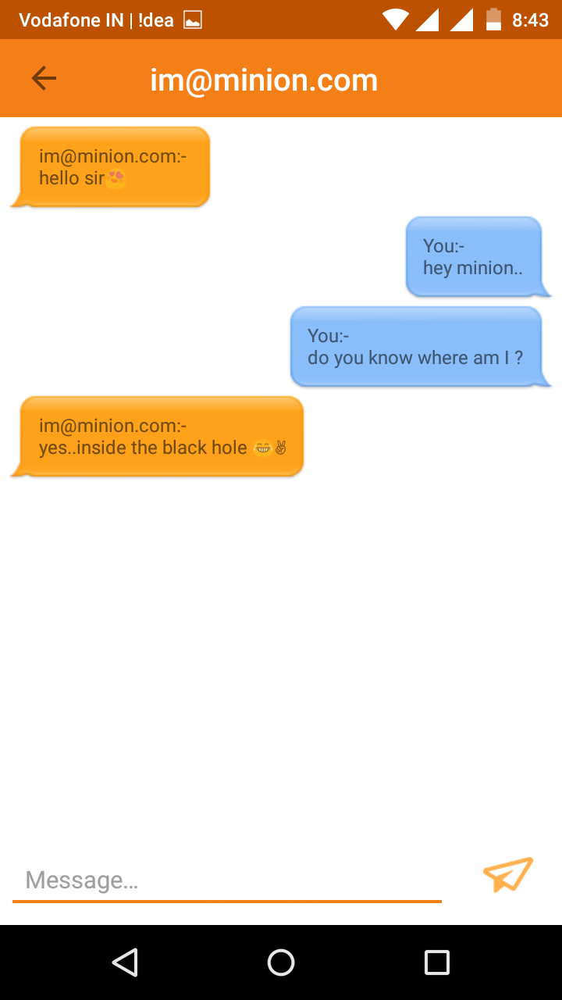
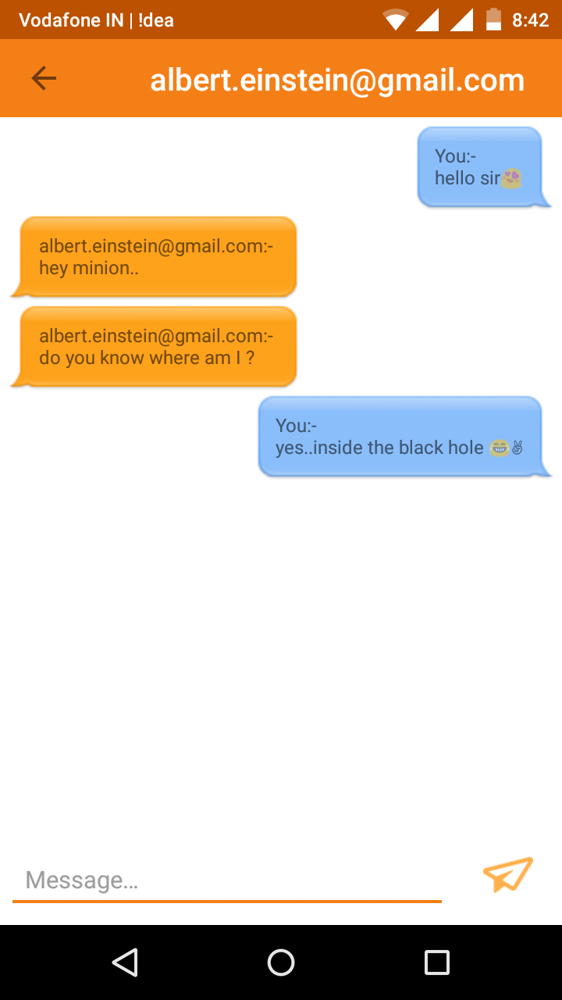

# AndroidChatApp
Android Single Chat App using Firebase :)

## Screenshots :

### 1.Splash Screen

### 2.Register Screen

### 3.Login Screen

### 4.Users Screen

### 5.Chat View
##### (logged in as albert.einstein@gmail.com and chat with im@minion.com)

##### (logged in as im@minion.com and chat with albert.einstein@gmail.com)

